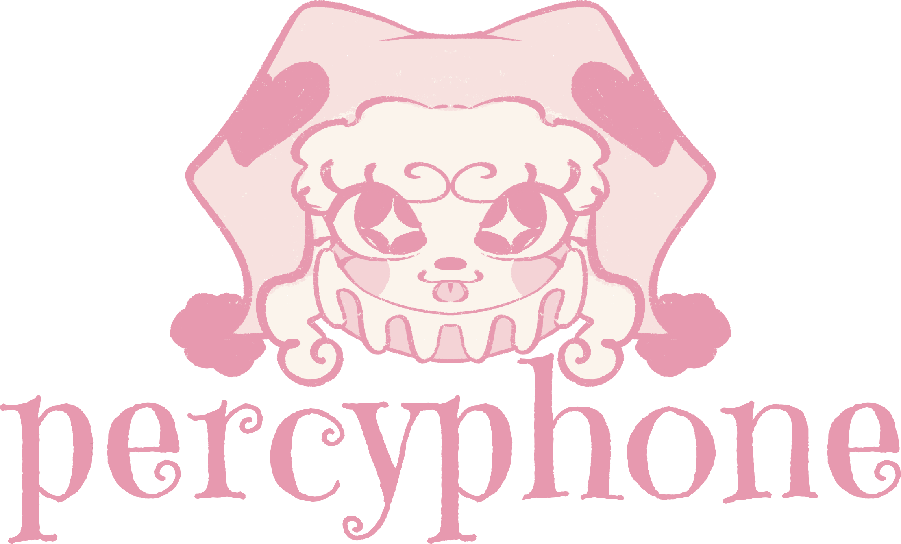

<h1 align="center"> Percyphone </h1>
This is an e-commerce website for Percyphone. It utilizes Snipcart, React, Supabase, and Express to make a cutesy-aesthetic experience for Percyphone's customers.

## Table of Contents
- [Table of Contents](#table-of-contents)
- [Description](#description)
- [User Story](#user-story)
- [Acceptance Criteria](#acceptance-criteria)
- [Contributing](#contributing)

## Description

I used this project to learn Supabase and PostgreSQL. This was an interesting experience! I enjoy that PostgreSQL allows arrays of objects to be saved, much like NoSQL, but has the more strict storage rules that I love from MySQL. 

## User Story

AS a customer of a small artist, 

I WANT to peruse his works on his own website,

View similar products as I peruse,

And purchase a product without worrying about payment security,

SO THAT I can support a creator without giving extra funds to Etsy.

## Acceptance Criteria

MVP IS DONE WHEN: 
- A product has its own page
- A product can be added to Snipcart's cart
- A product can have tags that identify it
- A product appears under said tags when searching
- A tag can be added as a section and appear on the navbar
- a homepage, faq, and aboutme page exists
- an admin can upload new products in an admin menu
- an admin can login with bcrypt encrypting its password
- an admin can successfully logout
- any admin pages are inaccessible to users who are not logged in

## Contributing

I am the sole contributor to this project. If you have questions about the way I code, feel free to reach out to me. 